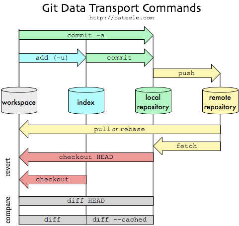

Git - Index
===========

This is a bonus/advanced section about how to use Git's index.

In previous sections we've mostly been concerned with commits
and their relationship with branches.
We have thus far ignored the actual file contents and the
different ways to add them to git.


Status
------

Let's actually look at what we did way back [in the beginning](commit.md).

```sh
> echo "hello" >> file.txt

> git add .

> git commit -m "Initial commit"

[master (root-commit) 406bb3b] Initial commit
 1 file changed, 1 insertion(+)
  create mode 100644 file.txt
```

There's actually something interesting going on there.
Let's slow it down, and use the `status` command to see
what Git thinks.

```sh
> echo "before" >> file.txt

> git status

Changes not staged for commit:
  (use "git add <file>..." to update what will be committed)
  (use "git checkout -- <file>..." to discard changes in working directory)

        modified:   file.txt

no changes added to commit (use "git add" and/or "git commit -a")
```

Assuming this isn't the first commit, git knows about `file.txt`
and is suggesting to use `git add`.


> What happens if you commit at this point?


```sh
> git add file.txt

> git status

Changes to be committed:
  (use "git reset HEAD <file>..." to unstage)

        modified:   file.txt
```

Now the message has changed.
Let's do something slightly different this time and update the file.


```sh
> echo "after" >> file.txt

> git status
Changes to be committed:
  (use "git reset HEAD <file>..." to unstage)

        modified:   file.txt

Changes not staged for commit:
  (use "git add <file>..." to update what will be committed)
  (use "git checkout -- <file>..." to discard changes in working directory)

        modified:   file.txt
```


> What do you think will happen when we commit?

> What happens if you delete a file that is in index?


Index
-----

So to expand on what you're seeing.

Git has something it calls the [index](https://schacon.github.io/gitbook/7_the_git_index.html),
which some people prefer to call the "staging area".
What's important to note is that _every_
file has to pass through the index before it can be committed.


Diff
----

So let's look at what git think has changed?

```sh
> git diff

diff --git a/file.txt b/file.txt
index 694fba8..e5b1b05 100644
--- a/file.txt
+++ b/file.txt
@@ -2,3 +2,4 @@ hello
 hello again
 goodbye
 before
+after
```

Hmm, so that's only the change _after_ we run `git add`.
Let's compare the working copy with the last commit - `HEAD`.

```sh
> git diff HEAD

diff --git a/file.txt b/file.txt
index 694fba8..e5b1b05 100644
--- a/file.txt
+++ b/file.txt
@@ -2,3 +1,5 @@ hello
 hello again
 goodbye
+before
+after
```

So how can we see _just_ the changes in the index?

```sh
> git diff --staged

diff --git a/file.txt b/file.txt
index 694fba8..e5b1b05 100644
--- a/file.txt
+++ b/file.txt
@@ -1,3 +1,4 @@ hello
 hello again
 goodbye
+before
```

Note the lack of "after" in that diff.

I find `diff --staged` a really useful way to see _exactly_ what
is going to be committed, just before running `git commit`.


Reference
---------

The following is a _great_ guide for all the different



The only think that's missing is
`git diff --staged` in the bottom compare section between
the index and local repository.


Tips
----

- Check out `add --patch`, it's a very handy way of selecting which parts
  of a file to add to the index.
